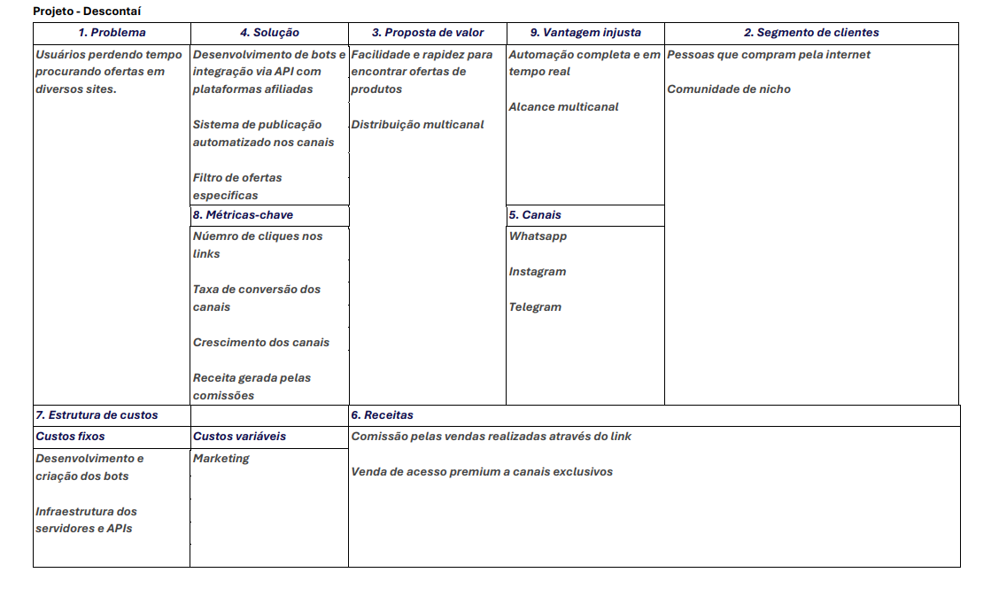

<p align="center">
  
</p>

## 🚀 Visão Geral do Projeto

**Descontaí** é um sistema de busca e notificação de ofertas. Nossa plataforma realiza varreduras na internet para encontrar as melhores promoções de e-commerce e as distribui em tempo real para os clientes através de grupos de WhatsApp. O modelo de negócio é baseado em parcerias e afiliações, garantindo um serviço gratuito e de alta qualidade.

---

## 👥 Equipe

| Nome | RA | GitHub |
| :--- | :--- | :--- |
| Gabriel Henrique Custodio | 815619 | [GabrielHenriqueCustodio](https://github.com/GabrielHenriqueCustodio) |
| João Eduardo Lino Quinteiro | 794595 | [djouni](https://github.com/djouni) |
| Jules Eloísio Moraes Lima | 818093 | [JulesElo](https://github.com/JulesElo) |
| Kleberson Crystyan de Lima | 801853 | [KlebersonCLima](https://github.com/KlebersonCLima) |
| Vitor Hugo Granato Moreira do Prado | 818814 | [VitorGranato](https://github.com/VitorGranato) |

---

## 📋 Etapas do Projeto

### 1️⃣ Definição do Problema e da Solução

#### **Problema Identificado**

Hoje em dia, com o grande volume de lojas online e promoções espalhadas pela internet, os consumidores perdem tempo procurando por ofertas e, muitas vezes, acabam pagando mais caro por não encontrar a melhor opção disponível. A busca manual por produtos em diferentes e-commerces é ineficiente e frustrante.

#### **Público-Alvo**

Nosso público-alvo são consumidores que buscam economizar e que estão habituados com compras online. Esse grupo inclui desde estudantes e jovens adultos, que procuram descontos em produtos de tecnologia, até famílias que desejam economizar em itens do dia a dia. A conveniência de receber ofertas diretamente no WhatsApp atrai pessoas que valorizam praticidade e agilidade.

#### **Impacto Esperado**

A **Descontaí** tem o objetivo de gerar um impacto positivo tanto para os consumidores quanto para as lojas parceiras. Para os clientes, o impacto esperado é a **economia de tempo e dinheiro**, oferecendo acesso rápido e simplificado às melhores promoções. Para as lojas, o projeto visa aumentar o tráfego e as vendas, uma vez que as ofertas chegam a um público qualificado e interessado em comprar.

#### **Solução Proposta**

A solução proposta é um sistema de varredura automatizada que, utilizando web scraping e outras técnicas, busca em tempo real por ofertas em diversas plataformas de e-commerce. As ofertas mais relevantes são selecionadas, categorizadas e, em seguida, enviadas de forma instantânea para os clientes através de grupos de WhatsApp. Esse processo garante que o consumidor receba as melhores oportunidades de compra sem esforço.

---

### 2️⃣ Lean Canvas / Missão, Visão e Valores

O **Lean Canvas** é uma ferramenta de planejamento estratégico que descreve de maneira concisa e visual os elementos-chave de um negócio. Nosso modelo está detalhado na imagem abaixo.

**Missão:** Democratizar o acesso às melhores ofertas online, conectando consumidores a promoções exclusivas de forma inteligente e gratuita.

**Visão:** Ser a principal plataforma de referência para economia e consumo inteligente no Brasil, tornando-se sinônimo de "oferta imperdível" e expandindo a atuação para outras plataformas de comunicação e canais de nicho.

**Valores:**
* **Confiança e Economia:** Compromisso em encontrar e entregar as melhores ofertas, construindo uma relação de confiança com nossos clientes.
* **Inovação Contínua:** Busca constante por novas tecnologias e metodologias para otimizar a varredura e a distribuição das promoções.
* **Agilidade:** Proporcionar aos clientes acesso imediato às oportunidades, garantindo que as ofertas cheguem em tempo real.



---

### 3️⃣ PNBOX

Diversas seções do nosso plano de negócios - incluindo estimativas de custos, investimentos e outros dados relevantes - estão detalhadas no sistema [PNBOX](https://pnbox.sebrae.com.br/planoNegocio/invite/gaDwQWdem), do Sebrae.

---

### 4️⃣ Levantamento de Custos e Despesas

O estudo financeiro detalhado, que identifica e classifica (fixos/variáveis, diretos/indiretos) os custos e despesas da **Descontaí**, é crucial para a projeção de viabilidade do negócio.

O material completo, com as estimativas de valor e premissas utilizadas, está disponível no documento: [Estudo de Custos e Despesas](docs/custos_estudo.md)

*Nota: Essas informações também estão presentes no sistema PNBOX, cujo link se encontra na seção 3.*

---

### 5️⃣ Investimentos e Precificação

Esta seção define os **investimentos** (fixo, pré-operacional e capital de giro) e a **estratégia de precificação** da **Descontaí**.

O levantamento completo e detalhado está disponível no documento: [Plano de Negócio](docs/plano_de_negocio.md)

*Nota: Essas informações também estão presentes no sistema PNBOX, cujo link se encontra na seção 3.*

---

### 6️⃣ Tributos e Enquadramento Empresarial

A viabilidade jurídica e fiscal da **Descontaí** foi definida, priorizando a simplicidade e a redução da carga tributária na fase inicial, com foco no Simples Nacional.

| Aspecto | Resumo |
| :--- | :--- |
| Natureza Jurídica |	Sociedade Limitada (LTDA) |
| Regime Tributário |	Simples Nacional |
| Tributação Incidente | Focada em ISS e demais tributos unificados na DAS |
| Obrigações Acessórias |	Emissão de NF de serviço, Livro Caixa e DEFIS anual |

O detalhamento completo da justificativa e do cenário tributário está disponível no documento: [Plano de Negócio](docs/plano_de_negocio.md)

*Nota: Essas informações também estão presentes no sistema PNBOX, cujo link se encontra na seção 3.*

---

### 7️⃣ SWOT – Análise de Ambientes

O diagnóstico estratégico é realizado através da Matriz SWOT (Forças, Fraquezas, Oportunidades e Ameaças), fundamental para o posicionamento de mercado.

| Aspecto | Resumo |
| :--- | :--- |
| **Forças** | Automação do processo de coleta e envio de ofertas (baixo custo operacional) e integração com múltiplos canais (WhatsApp/Telegram) |
| **Fraquezas** | Baixa visibilidade inicial, ausência de base de usuários consolidada e dependência de políticas externas (APIs e programas de afiliados) |
| **Oportunidades** | Crescimento do e-commerce e da cultura de consumo digital no Brasil |
| **Ameaças** | Concorrentes consolidados (ex: Pelando, Promobit) e alterações nas regras de uso de bots e APIs de mensageria |

O detalhamento completo da Matriz SWOT e a análise de concorrência encontram-se no documento: [Plano de Negócio](docs/plano_de_negocio.md)

---

### 8️⃣ Planejamento Estratégico (BSC)

O planejamento estratégico da empresa está disponível na seguinte planilha: [Acessar planilha](./docs/planejamento_estrategico.xlsx)

---

### 9️⃣ Fluxo de Caixa

O fluxo de caixa da empresa está disponível na seguinte planilha: [Acessar planilha](./docs/fluxo_de_caixa.xlsx)

---

### 🔟 Valuation

####  Metodologia

A metodologia central utilizada para estimar o valor potencial do negócio foi o **Fluxo de Caixa Descontado (FCD)**.

Este método projeta os fluxos de caixa futuros que a empresa espera gerar e os desconta a valor presente, utilizando uma taxa de desconto (WACC) que reflete os riscos do negócio. O cálculo também inclui a estimativa de um Valor Terminal (Perpetuidade) para capturar o valor da empresa após o período de projeção explícito.

As premissas detalhadas e os cálculos estão disponíveis no documento principal.

#### Relatório Completo

Para acessar o relatório sintético com a análise detalhada, cálculos e premissas, acesse o link abaixo:

* **[Relatório de Valuation - Descontaí](./docs/valuation_grupo02.pdf)**

---

### 1️⃣1️⃣ Segurança Cibernética

*Nota: Esta etapa está atualmente **em planejamento**.*

- Riscos identificados:
- Medidas de segurança:

---

## 📅 Diário de Bordo

| Data       | Conteúdo/Etapa                                                 | Status | Observações |
| ---------- | -------------------------------------------------------------- | ------ | ----------- |
| 06/08/2025 | Apresentação Disciplina + Start                                | ✅ Concluído | — |
| 13/08/2025 | Definição dos Grupos e Propostas                               | ✅ Concluído | Ajustar proposta com feedback do professor |
| 20/08/2025 | Modelagem do Problema - Lean Canvas / Missão, Visão e Valores  | ✅ Concluído | — |
| 27/08/2025 | Entrevista 01 - Acompanhamento das Atividades / Validação      | ✅ Concluído | — |
| 03/09/2025 | Custos e Tributos (Plano de Negócios - PNBOX)                  | ✅ Concluído | — |
| 10/09/2025 | Investimentos e Precificação (Plano de Negócios - PNBOX)       | ✅ Concluído | — |
| 17/09/2025 | Acompanhamento Plano de Negócios                               | ✅ Concluído | — |
| 24/09/2025 | Entrevista 02 - Acompanhamento das Atividades / Validação      | ✅ Concluído | — |
| 01/10/2025 | Análise de Ambientes - SWOT                                    | ✅ Concluído | — |
| 08/10/2025 | BSC e Planilha de Planejamento Estratégico                     | 🚧 Em andamento | — |
| 15/10/2025 | Fluxo de Caixa / Planilha Fluxo de Caixa                       | ⏳ Pendente | — |
| 22/10/2025 | Seminários                                                     | ⏳ Pendente | — |
| 29/10/2025 | Entrevista 03 - Acompanhamento das Atividades / Validação      | ⏳ Pendente | — |
| 05/11/2025 | Valuation                                                      | ⏳ Pendente | — |
| 12/11/2025 | Compliance em TI: Legislação                                   | ⏳ Pendente | — |
| 19/11/2025 | Segurança Cibernética no Produto                               | ⏳ Pendente | — |
| 26/11/2025 | Apresentação Banca (3 grupos)                                  | ⏳ Pendente | — |
| 03/12/2025 | Apresentação Banca (3 grupos)                                  | ⏳ Pendente | — |
| 10/12/2025 | Apresentação Banca (3 grupos)                                  | ⏳ Pendente | — |
| 17/12/2025 | Divulgação Melhor Produto - Concurso                           | ⏳ Pendente | — |
| 17/12/2025 | Organização e Estruturação do Projeto GitHub                   | ⏳ Pendente | — |

---

## 📦 Entregas

| Entrega                                       | Data       | Descrição                                                            | Status |
| --------------------------------------------- | ---------- | -------------------------------------------------------------------- | ------ | 
| Lean Canvas                                   | 27/08/2025 | Documento e Imagem do Canvas                                         | ✅ Concluído |  
| Custos e Despesas                             | 10/09/2025 | Planilha com Custos Fixos, Variáveis e Tributos                      | ✅ Concluído |
| Investimentos e Precificação                  | 17/09/2025 | Levantamento Completo dos Investimentos e Estratégia de Precificação | ✅ Concluído |
| Plano de Negócios (Finalização com Tributos)  | 24/09/2025 | Entrega do Plano de Negócios                                         | ✅ Concluído |
| Análise SWOT                                  | 08/10/2025 | Análise de Ambientes SWOT                                            | ✅ Concluído |
| Planejamento Estratégico                      | 15/10/2025 | Planejamento Estratégico                                             | 🚧 Em andamento |
| Fluxo de Caixa                                | 29/10/2025 | Planilha de Fluxo de Caixa                                           | ⏳ Pendente |
| Valuation                                     | 12/11/2025 | Relatório com Cálculo de Valuation                                   | ⏳ Pendente |

---

## 🗣️ Feedbacks Recebidos

| Data       | De Quem | Feedback | Ação Tomada |
| ---------- | ------- | -------- | ----------- |
| — | — | — | — |

---

## 📚 Lições Aprendidas

- Na análise tributária, concluímos que o Simples Nacional é a melhor opção, especialmente no início. Ele simplifica o processo ao unificar os impostos em uma única guia (DAS), o que é fundamental para reduzir a burocracia. Isso permite que a equipe dedique menos tempo às questões contábeis e mais tempo ao desenvolvimento do negócio e à prospecção de clientes.

- A realização da análise SWOT foi essencial para identificarmos pontos-chave como nossas forças, fraquezas, oportunidades e ameaças. Esse processo nos ajuda a focar de forma mais eficiente, direcionando nossos esforços para as áreas que precisam de atenção e melhorias. Também percebemos a importância de revisar essa análise periodicamente para garantir que estamos sempre alinhados com o cenário atual.

---

## 📁 Organização do Repositório  

```
│   README.md
│
└───docs
    │   custos_estudo.md
    │   plano_de_negocio.md
    │
    └───images
        │   lean_canvas.png
        │   logo.png
        │
        ├───custos_e_despesas
        │       custos_fixos.png
        │       custos_variaveis.png
        │       investimento_pre_operacional.png
        │
        └───plano_de_negocio
                investimento_fixo.png
                investimento_pre_operacional.png
```
