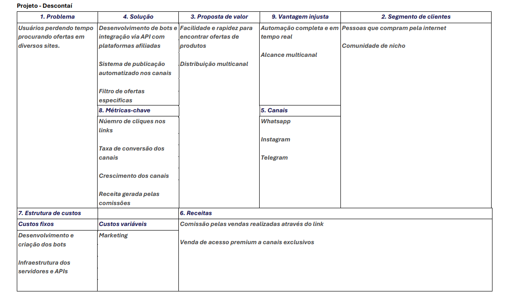

# 📌 Projeto - Descontaí 
**Centralizador de Promoções no WhatsApp**  

Breve descrição: Projeto de marketing de afiliados que reúne ofertas de sites diversos, organiza os descontos e compartilha em grupos de WhatsApp, facilitando o acesso dos usuários às melhores oportunidades de compra em tempo real.  

---

## 👥 Integrantes  
- Kleberson Crystyan de Lima – RA: 801853  
- Vitor Hugo Granato Moreira do Prado – RA: 818814
- João Eduardo Lino Quinteiro – RA: 794595
- Jules Eloisio Moraes Lima – RA: 818093
- Gabriel Henrique Custodio – RA: 815619

---

## 🧭 Etapas do Projeto  

### 1️⃣ Definição do Problema e da Solução  
- **Problema identificado:** Consumidores gastam tempo navegando em diversos sites em busca de descontos confiáveis.  
- **Público-alvo:** Jovens adultos e famílias que buscam economia em compras online.  
- **Impacto esperado:** Aumentar a eficiência na busca por promoções, gerando economia de tempo e dinheiro.  
- **Solução proposta:** Criar um grupo no WhatsApp que centraliza ofertas extraídas de diferentes sites parceiros via marketing de afiliados.  

---

### 2️⃣ Lean Canvas / Missão, Visão e Valores  
- **Missão:** Simplificar o acesso a promoções online de forma prática e segura.  
- **Visão:** Ser referência em curadoria de ofertas digitais via WhatsApp no Brasil.  
- **Valores:** Transparência, praticidade, inovação e foco no usuário.  
 

---

### 3️⃣ Custos e Tributos (Plano de Negócios - PNBOX)  

Link para acessar o PNBOX: https://pnbox.sebrae.com.br/planoNegocio/invite/gaDwQWdem

[Custos e tributos](docs/custos_estudo.md)

---

### 4️⃣ Investimentos e Precificação  

[Plano de Négocio](docs/plano_de_negocio.md)

---

### 5️⃣ SWOT (Análise de Ambientes)  
- **Forças:** Custo baixo, alta escalabilidade, acesso direto ao usuário via WhatsApp.  
- **Fraquezas:** Dependência de plataformas externas e confiabilidade das ofertas.  
- **Oportunidades:** Crescente uso do WhatsApp e e-commerce no Brasil.  
- **Ameaças:** Concorrência de grandes players e mudanças em regras de programas de afiliados.  

---

### 6️⃣ Planejamento Estratégico (BSC)  
- **Objetivos estratégicos:** Expandir base de usuários através de trafégo pago e fortalecer parcerias com marketplaces.  
- **Indicadores e metas:** Crescimento mensal de 20% em membros do grupo; aumento de receita por comissão.  
- **Ações planejadas:** Marketing digital em redes sociais, gamificação para engajamento no grupo.  

---

### 7️⃣ Fluxo de Caixa  
- **Planilha:** (Ainda em planejamento, e definindo valores correspondentes, será atualizado em breve).
- **Principais considerações:** Receita variável (dependente de vendas), custos fixos baixos.  

---

### 8️⃣ Valuation  
- **Método utilizado:** Fluxo de Caixa Descontado.  
- **Valor estimado:** Simulação em sala (dependerá das projeções financeiras desenvolvidas).  

---

### 9️⃣ Segurança Cibernética  
- **Riscos identificados:** Vazamento de dados do grupo, links maliciosos de terceiros.  
- **Medidas de segurança:** Curadoria manual das ofertas, monitoramento constante e uso de links confiáveis.  

---

## 📅 Diário de Bordo  

| Data       | Conteúdo/Etapa                     | Status     | Observações |
|------------|------------------------------------|------------|-------------|
| 06/08/2025 | Apresentação Disciplina + Start    | ✅ Concluído | — |
| 13/08/2025 | Definição dos Grupos e Propostas   | 🚧 Em andamento | Ajustar proposta com feedback do professor |

---

## 📦 Entregas  

| Entrega                                | Data       | Descrição                                                         | Status |
|----------------------------------------|------------|-------------------------------------------------------------------|--------|
| Lean Canvas                            | 20/08/2025 | Documento e imagem do canvas                                      | —      |
| Custos e Tributos                      | 27/08/2025 | Planilha com custos fixos, variáveis e tributos                   | —      |
| Análise SWOT / Plano de Negócios       | 24/09/2025 | Análise de ambientes SWOT e entrega do Plano de Negócios          | —      |
| Fluxo de Caixa / Planejamento Estratégico | 15/10/2025 | Planilha de fluxo de caixa e entrega do Planejamento Estratégico  | —      |
| Valuation                              | 05/11/2025 | Relatório com cálculo de valuation                                | —      |

---

## 🗣️ Feedbacks Recebidos  

| Data       | De Quem     | Feedback                                                        | Ação Tomada |
|------------|-------------|----------------------------------------------------------------|-------------|
| 24/09/2025 | Professor X | Melhorar clareza da análise SWOT                                | Revisão feita |

---

## 📚 Lições Aprendidas  
- Planejamento estratégico facilita o alinhamento da equipe.  
- O marketing de afiliados pode ser viável com baixo investimento inicial.  
- A segurança cibernética é essencial mesmo em projetos simples.  

---

## 📁 Organização do Repositório

📦 projeto/
┣ 📂 docs/
┃ ┣ lean_canvas.png
┃ ┣ custos_tributos.xlsx
┃ ┣ swot_plano_negocios.pdf
┃ ┣ fluxo_caixa_planejamento.xlsx
┃ ┗ valuation.pdf
┣ 📂 src/
┃ ┣ prototipo/
┃ ┗ documentos_planejamento/
┗ README.md
