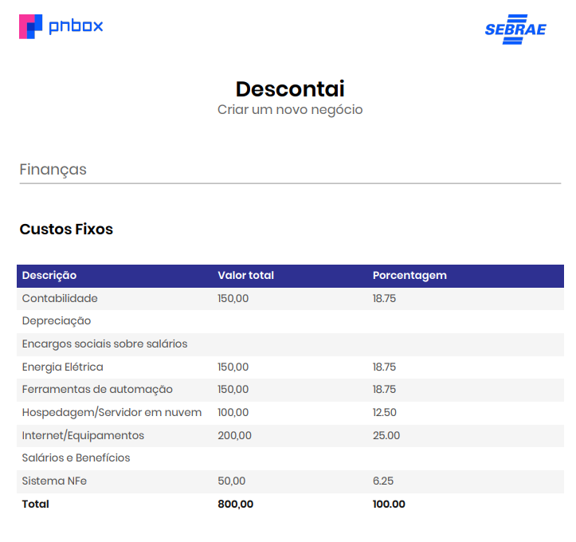
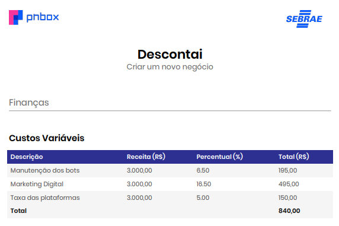
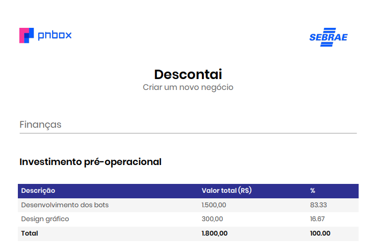

# 📊 Estudo de Custos e Despesas

Este documento apresenta a identificação, classificação e estimativas de custos e despesas da empresa **Descontaí**.

---

#### 🔙 [Voltar ao README](../README.md)

### 📄 Sumário

* [1. Classificação dos Custos e Despesas](#1-classificação-dos-custos-e-despesas)
    * [1.1. Custos Fixos](#11-custos-fixos)
    * [1.2. Custos Variáveis](#12-custos-variáveis)
    * [1.3. Despesas Operacionais](#13-despesas-operacionais)
* [2. Resumo dos Custos e Despesas Estimados](#2-resumo-dos-custos-e-despesas-estimados)
* [3. Observações](#3-observações)
* [4. Imagens - PNBOX](#4-imagens-pnbox)

---

## 1️⃣ Classificação dos Custos e Despesas

###  1.1. Custos Fixos

| Item | Fixo/Variável | Direto/Indireto | Estimativa (R$) | Premissas |
| :--- | :------------ | :-------------- | :-------------- | :-------- |
| Servidor | Fixo | Direto | 200 | Necessário para manter os bots e integração via API ativos |
| Ferramenta de encurtamento de links | Fixo          | Direto          | 50              | Assinatura mensal para rastreamento de cliques |
| Domínio e e-mail profissional       | Fixo          | Indireto        | 20              | Custo mensal médio (R$240/ano) |
| Internet                            | Fixo          | Indireto        | 200             | Plano residencial ou corporativo |
| Energia elétrica                    | Fixo          | Indireto        | 150             | Consumo médio de computadores e equipamentos |

###  1.2. Custos Variáveis

| Item                               | Fixo/Variável | Direto/Indireto | Estimativa (R$) | Premissas                                               |
| :--------------------------------- | :------------ | :-------------- | :-------------- | :------------------------------------------------------ |
| API WhatsApp Business              | Variável      | Direto          | 250             | Envio de mensagens automáticas (~R$0,05/msg, 5.000/mês) |
| Manutenção e atualizações do bot   | Variável      | Direto          | 100             | Eventuais ajustes técnicos e APIs                       |

###  1.3. Despesas Operacionais

| Item                                | Fixo/Variável | Direto/Indireto | Estimativa (R$) | Premissas                                             |
| :---------------------------------- | :------------ | :-------------- | :-------------- | :---------------------------------------------------- |
| Pró-labore dos 5 sócios             | Fixo          | Indireto        | 10.000          | R$2.000/mês por sócio                                 |
| Contabilidade                       | Fixo          | Indireto        | 250             | Serviço de contabilidade online (Simples Nacional)    |
| Marketing terceirizado              | Fixo          | Indireto        | 500             | Agência ou freelancer para gerenciar anúncios         |
| Anúncios pagos (Meta Ads)           | Variável      | Direto          | 500             | Investimento mensal para aquisição de clientes        |
| Canva Pro                           | Fixo          | Indireto        | 35              | Criação de postagens e materiais gráficos             |
| Taxas e impostos (Simples Nacional) | Variável      | Indireto        | 200             | Estimado em ~6% sobre comissões e receita             |

---

## 2️⃣ Resumo dos Custos e Despesas Estimados

| **Categoria** | **Descrição / Itens Incluídos** | **Estimativa (R$)** |
| :------------ | :------------------------------ | :------------------ |
| **Custos Fixos Mensais Recorrentes** | Servidor + Encurtador de links + Internet + Energia + Domínio e e-mail | $\approx$ R\$620 |
| **Custos Variáveis Mensais** | API WhatsApp + Manutenção do bot | $\approx$ R\$350 |
| **Despesas Operacionais Mensais** | Pró-labore + Contabilidade + Marketing Terceirizado + Anúncios Pagos + Canva Pro + Taxas e Impostos | $\approx$ R\$11.485 |
| **Total** | | $\approx$ R\$12.455 |

---

## 3️⃣ Observações

* Premissas baseadas em valores médios de mercado para projetos de automação e marketing digital de pequeno porte.
* Os valores podem variar de acordo com os fornecedores escolhidos (hospedagem, tráfego pago, ferramentas de automação).

---

## 4️⃣ Imagens - PNBOX

