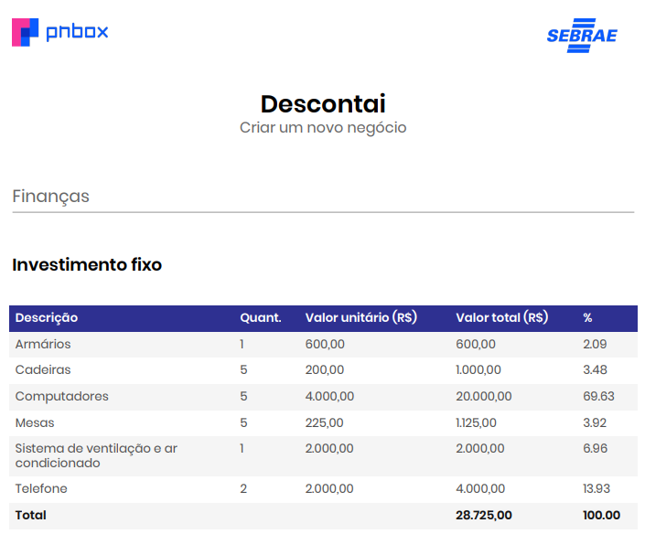
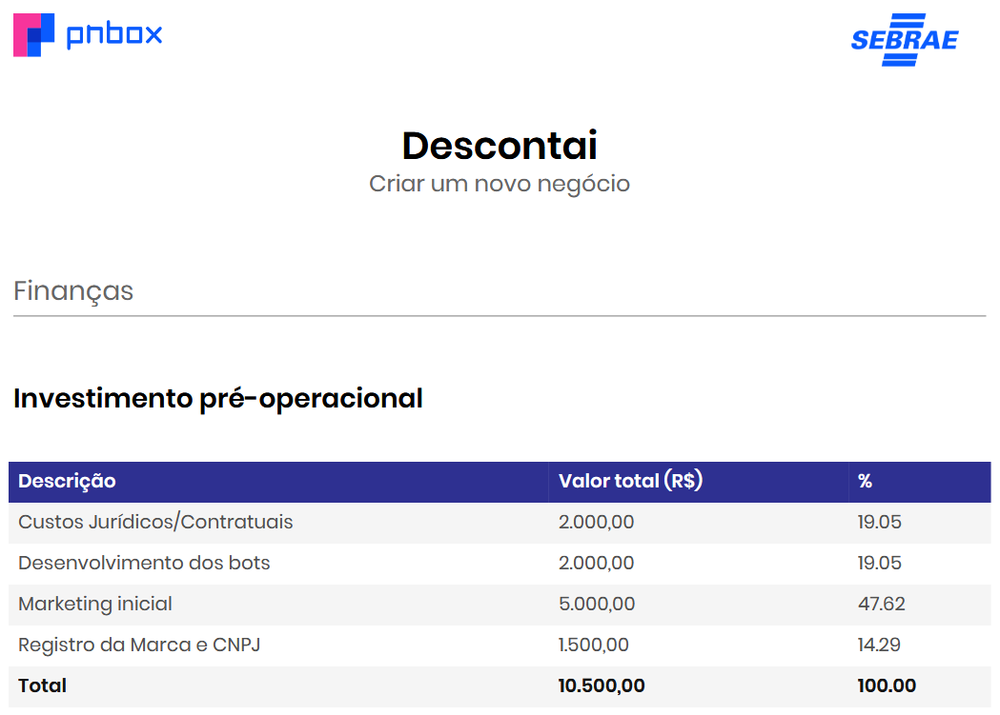

# 🎯 Plano de Negócio

#### 🔙 [Voltar ao README](../README.md)

### 📄 Sumário

* [1. Investimentos](#1-investimentos)
    * [1.1. Investimento Fixo](#11-investimento-fixo)
    * [1.2. Investimento Pré-Operacional](#12-investimento-pré-operacional)
    * [1.3. Capital de Giro](#13-capital-de-giro)
* [2. Precificação](#2-precificação)
    * [2.1. Valor Entregue](#21-valor-entregue)
    * [2.2. Capacidade de Pagamento](#22-capacidade-de-pagamento)
    * [2.3. Concorrência](#23-concorrência)
    * [2.4. Modelo de Precificação](#24-modelo-de-precificação)
    * [2.5. Periodicidade](#25-periodicidade)
    * [2.6. Métricas](#26-métricas)
* [3. Enquadramento Empresarial](#3-enquadramento-empresarial)
    * [3.1. Enquadramento Jurídico](#31-enquadramento-jurídico)
    * [3.2. Regime Tributário](#32-regime-tributário)
    * [3.3. Tributação Incidente](#33-tributação-incidente)
    * [3.4. Obrigações Acessórias](#34-obrigações-acessórias)
* [4. Diagnóstico Estratégico – Matriz SWOT (FOFA)](#4-diagnóstico-estratégico--matriz-swot-fofa)
    * [4.1. Pesquisa de Mercado e Concorrência](#41-pesquisa-de-mercado-e-concorrência)
    * [4.2. Análise de Ameaças e Oportunidades](#42-análise-de-ameaças-e-oportunidades)
    * [4.3. Matriz SWOT (FOFA)](#43-matriz-swot-fofa)

---

## 1️⃣ Investimentos

###  1.1 Investimento Fixo

| Item | Descrição | Valor (R$) |
| :--- | :--- | :--- |
| **Movéis e Infraestrutura Física** | 5 Mesas de Escritório | R$ 1.125,00 |
| | 5 Cadeiras Ergonômicas | R$ 1.000,00 |
| | Sistema de Ventilação e Ar-Condicionado | R$ 2.000,00 |
| **Equipamentos** | 5 Computadores | R$ 20.000,00 |
| **TOTAL** | | **R$ 24.125,00** |

###  1.2 Investimento Pré-Operacional

| Item | Descrição | Valor (R$) |
| :--- | :--- | :--- |
| Registro da Marca e CNPJ | Custos de formalização | R$ 1.000,00 |
| Marketing inicial | Campanhas de lançamento | R$ 500,00 |
| **TOTAL** | | **R$ 1.500,00** |

###  1.3 Capital de Giro

| Item                                   | Descrição                                                            | Valor Mensal Estimado (R$) |
| :------------------------------------- | :------------------------------------------------------------------- | :------------------------- |
| **Pró-labore (5 sócios)**              | Remuneração mensal dos sócios (R$ 2.000 cada)                        | **R$ 10.000,00**           |
| **Infraestrutura e sistemas**          | Servidor, API WhatsApp, encurtador de links e manutenção técnica     | **R$ 600,00**              |
| **Serviços e utilidades**              | Internet, energia elétrica, domínio, e-mail profissional e Canva Pro | **R$ 405,00**              |
| **Marketing e divulgação**             | Marketing terceirizado + anúncios pagos (Meta Ads)                   | **R$ 1.000,00**            |
| **Contabilidade e obrigações fiscais** | Escritório contábil e tributos (Simples Nacional)                    | **R$ 450,00**              |
| **Total mensal estimado**              |                                                                      | **R$ 12.455,00**           |

- O capital de giro mínimo ideal deve cobrir pelo menos 3 meses de operação, ou seja, aproximadamente R$ 37.365,00.

---

## 2️⃣ Precificação

###  2.1 Valor Entregue

* **Benefícios:** acesso rápido a promoções e descontos, economia de tempo e recursos.
* **Diferencial:** automação no compartilhamento de ofertas, integração com múltiplos sites de afiliados e personalização de recomendações.

###  2.2 Capacidade de Pagamento

* **Público-Alvo:** consumidores digitais, usuários de WhatsApp, adeptos de compras online.
* **Pesquisa de Mercado:** análise de disposição para pagamento pelo serviço.

###  2.3 Concorrência

* Identificação de concorrentes diretos e indiretos.
* Comparação de modelos de negócios e diferenciais oferecidos.
* **Posicionamento Estratégico:** definição do nicho de mercado e proposta de valor única.

###  2.4 Modelo de Precificação

* **Monetização:** comissão por vendas realizadas através de links de afiliados.
* **Planos de Assinatura:** acesso a ofertas personalizadas com maior frequência.
    * Mensal: R$ 19,90
    * Trimestral: R$ 49,90
    * Anual: R$ 149,90
* **Modelo Freemium:** funcionalidades básicas gratuitas e opções pagas avançadas.

###  2.5 Periodicidade

* Cobrança Mensal ou Anual, baseada no engajamento do usuário.

###  2.6 Métricas

* **CAC (Custo de Aquisição de Cliente):** R$ 15 (mídia paga + campanhas digitais).
* **ARPU (Receita Média por Usuário):** R$ 20/mês.
* **LTV (Lifetime Value):** R$ 240 (considerando retenção média de 12 meses).

---

## 3️⃣ Enquadramento Empresarial

###  3.1 Enquadramento Jurídico

Considerando a nossa estrutura (somos cinco integrantes) e a natureza do nosso negócio, entendemos que a melhor opção de natureza jurídica para a Descontaí é a **Sociedade Limitada (LTDA)**.

A nossa escolha se deve ao fato de que a **LTDA** é a forma mais **comum** e **segura** para empresas com múltiplos sócios. Ela nos oferece **proteção patrimonial**, separando as finanças da empresa das nossas finanças pessoais. Nossa responsabilidade fica limitada ao valor de nossas cotas no capital social. Isso é ideal para a Descontaí, pois nos permite participar da sociedade de forma **segura** e **organizada**.

###  3.2 Regime Tributário

Para o nosso modelo de negócio, o regime tributário mais vantajoso, especialmente neste início, é o **Simples Nacional**.

O motivo da escolha é que esse regime simplificado **unifica o pagamento de vários impostos** (IRPJ, CSLL, PIS, COFINS, IPI, ISS e ICMS) em uma **única guia (DAS)**. Essa simplicidade **reduz a burocracia e facilita a nossa gestão financeira**, o que é fundamental para uma startup como a nossa.

A alíquota inicial é menor e a tributação é progressiva, ou seja, aumenta conforme o nosso faturamento. O limite de faturamento anual do Simples Nacional é de R$ 4,8 milhões, o que é mais do que suficiente para a fase inicial da Descontaí.

Não escolhemos nem o Lucro Presumido nem o Lucro Real, pois esses regimes **são mais complexos** e, em geral, mais caros para empresas de pequeno e médio porte, especialmente quando o faturamento é baixo. Eles fariam mais sentido em uma fase de crescimento com faturamento muito alto, mas não para o início do nosso projeto.

###  3.3 Tributação Incidente

No Simples Nacional, nossa tributação se concentrará em:

- **IRPJ** e **CSLL**: Imposto de Renda Pessoa Jurídica e Contribuição Social sobre o Lucro Líquido.
- **PIS** e **COFINS**: Contribuições para o Programa de Integração Social e para o Financiamento da Seguridade Social.
- **INSS Patronal**: Contribuição para a Previdência Social.

Como nosso modelo de negócio é baseado em comissões por afiliação, nos enquadramos na prestação de serviços. Sendo assim, também pagaremos o **ISS (Imposto Sobre Serviços)**, de competência municipal. Não haverá incidência de **ICMS (imposto estadual sobre circulação de mercadorias)** nem de **IPI (imposto federal sobre produtos industrializados)**, já que não vendemos produtos.

###  3.4 Obrigações Acessórias

Mesmo simplificadas pelo Simples Nacional, nossas obrigações acessórias ainda exigem atenção:

- **Emissão de Notas Fiscais**: a cada comissão recebida dos marketplaces (Mercado Livre, Shopee, etc.), precisaremos emitir uma nota fiscal de serviço para formalizar a receita.
- **Livro Caixa**: manteremos o registro de todas as receitas e despesas para demonstrar nossa movimentação financeira.
- **Declarações Mensais e Anuais**: nossa principal obrigação será gerar e pagar mensalmente a guia do Simples Nacional (DAS) e entregar a Declaração de Informações Socioeconômicas e Fiscais (DEFIS) anualmente.
- **Contabilidade**: já estamos estudando a possibilidade e sabemos que é recomendável termos um contador, que ficará responsável por todas essas obrigações e por garantir que estejamos em dia com o fisco.

---

## 4️⃣ Diagnóstico Estratégico – Matriz SWOT (FOFA)

###  4.1 Pesquisa de Mercado e Concorrência

Foram analisados três concorrentes principais no mercado de divulgação de ofertas e cupons de desconto:

| **Concorrente** | **Descrição e Atuação** | **Diferenciais** | **Canais** | **Público-Alvo** | **Ameaças que representa** |
| :--- | :--- | :--- | :--- | :--- | :--- |
| **Pelando** | Plataforma e app comunitário onde usuários compartilham promoções e descontos de lojas diversas. | Grande base de usuários e credibilidade no mercado; sistema de votação e comentários. | Site, aplicativo e redes sociais. | Consumidores que buscam descontos verificados e interação com a comunidade. | Forte engajamento e reconhecimento da marca dificultam entrada de novos players. |
| **Promobit** | Site e aplicativo que divulgam promoções e ofertas com links de afiliado. | Curadoria de ofertas por equipe interna, design profissional e presença em mídias digitais. | Site, app, Telegram e Instagram. | Público geral que busca ofertas confiáveis e cupons. | Domina resultados de busca e tem parcerias com grandes e-commerces. |
| **Ofertas do Dia (Grupos WhatsApp/Telegram)** | Canais independentes e informais que repassam promoções e links de afiliado. | Comunicação direta via grupos; alto alcance orgânico. | WhatsApp e Telegram. | Usuários que preferem receber ofertas diretamente no celular. | Saturação de grupos semelhantes e alta concorrência de canais informais. |

---

###  4.2 Análise de Ameaças e Oportunidades

#### **Ameaças**

* Concorrentes consolidados com grandes audiências e investimentos em marketing.
* Mudanças nas políticas de afiliados de plataformas como Amazon e Mercado Livre.
* Restrições de privacidade e bloqueio de bots em aplicativos de mensagem.

#### **Oportunidades**

* Crescimento do comércio eletrônico e do marketing de afiliados no Brasil.
* Expansão de grupos de compras e ofertas em redes sociais.
* Possibilidade de nichar o público (ex: tecnologia, games, produtos sustentáveis).

---

###  4.3 Matriz SWOT (FOFA)

| **Forças (Strengths)** | **Fraquezas (Weaknesses)** |
| :--- | :--- |
| 1. Automação do processo de coleta e envio de ofertas (reduz custo operacional). | 1. Baixa visibilidade inicial e ausência de base de usuários consolidada. |
| 2. Integração com múltiplos canais (WhatsApp e Telegram). | 2. Dependência de políticas externas (APIs e programas de afiliados). |
| 3. Facilidade de adaptação a diferentes nichos de mercado. | 3. Falta de equipe dedicada exclusivamente a marketing e relacionamento. |

| **Oportunidades (Opportunities)** | **Ameaças (Threats)** |
| :--- | :--- |
| 1. Crescimento do e-commerce e da cultura de consumo digital. | 1. Concorrentes com grandes bases de usuários e forte presença online. |
| 2. Parcerias com influenciadores e microempreendedores digitais. | 2. Alterações nas regras de uso de bots e APIs de mensageria. |
| 3. Expansão do marketing de afiliados e novas plataformas de monetização. | 3. Flutuação econômica afetando o poder de compra do público. |

---
